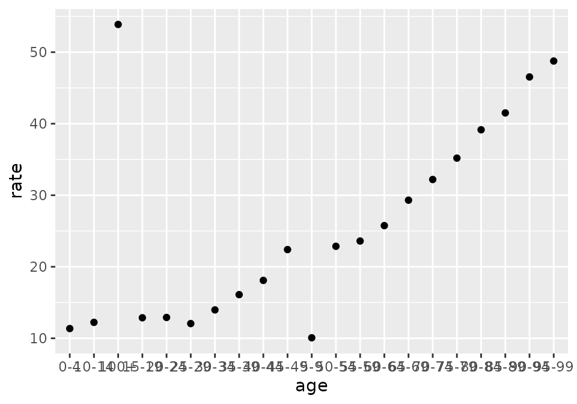
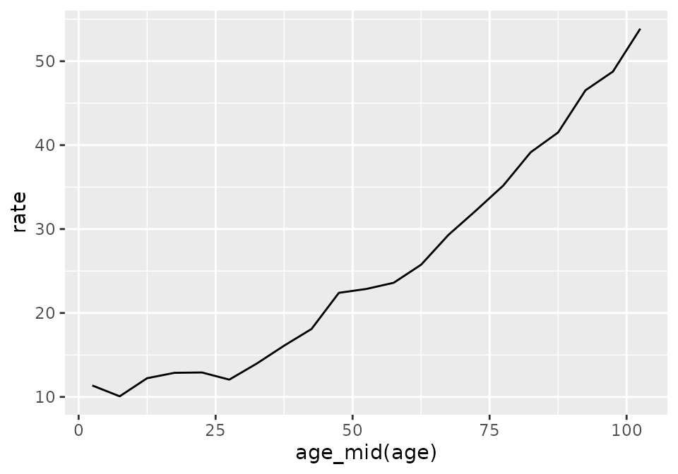

# Cookbook for agetime Package

``` r

library(agetime)
library(dplyr, warn.conflicts = FALSE)
library(ggplot2)
set.seed(0)
```

## Create and modify labels

### Create labels from scratch

#### Problem

Create a new set of age group, cohort, or period labels.

#### Solution

For labels with regular widths, use functions such as
[`age_labels_ten()`](https://bayesiandemography.github.io/agetime/reference/age_labels.md)
or
[`period_labels_five()`](https://bayesiandemography.github.io/agetime/reference/period_labels.md).

``` r

age_labels_ten()
#>  [1] "0-9"   "10-19" "20-29" "30-39" "40-49" "50-59" "60-69" "70-79" "80-89"
#> [10] "90-99" "100+"
period_labels_five(
  lower_first = 2001,
  lower_last = 2031
)
#> [1] "2001-2006" "2006-2011" "2011-2016" "2016-2021" "2021-2026" "2026-2031"
#> [7] "2031-2036"
```

For labels with irregular widths, use
[`age_labels()`](https://bayesiandemography.github.io/agetime/reference/age_labels.md),
[`period_labels()`](https://bayesiandemography.github.io/agetime/reference/period_labels.md),
or
[`cohort_labels()`](https://bayesiandemography.github.io/agetime/reference/cohort_labels.md),
and specify the breaks.

``` r

age_labels(
  breaks = c(0, 20, 65, 100),
)
#> [1] "0-19"  "20-64" "65-99" "100+"
cohort_labels(
  breaks = c(2000, 2010, 2030),
  open_left = TRUE
)
#> [1] "<2000"     "2000-2010" "2010-2030"
```

#### Discussion

There is no universally accepted set of conventions on how age, period,
and cohort labels should be formatted, but `agetime` tries to reflect
common practices.

#### See Also

- The help pages for
  [`age_labels()`](https://bayesiandemography.github.io/agetime/reference/age_labels.md),
  [`period_labels()`](https://bayesiandemography.github.io/agetime/reference/period_labels.md),
  and
  [`cohort_labels()`](https://bayesiandemography.github.io/agetime/reference/cohort_labels.md)
  describe `agetime` formatting rules

### Standardize labels

#### Problem

Convert age, period, or cohort labels to the default `agetime` style.

#### Solution

Use
[`age_standard()`](https://bayesiandemography.github.io/agetime/reference/age_standard.md),
[`period_standard()`](https://bayesiandemography.github.io/agetime/reference/period_standard.md),
or
[`cohort_standard()`](https://bayesiandemography.github.io/agetime/reference/cohort_standard.md).

``` r

df <- tibble(
  age = c("5to9", "10--14", "100plus", "infants"),
  count = c(11, 9, 2, 22)
)

df |>
  mutate(age = age_standard(age))
#> # A tibble: 4 × 2
#>   age   count
#>   <chr> <dbl>
#> 1 5-9      11
#> 2 10-14     9
#> 3 100+      2
#> 4 0        22
```

#### Discussion

If the `labels` argument is a factor, then the `standard` functions
standardize the factor levels along with the values.

#### See Also

- The help pages for
  [`age_standard()`](https://bayesiandemography.github.io/agetime/reference/age_standard.md),
  [`period_standard()`](https://bayesiandemography.github.io/agetime/reference/period_standard.md),
  and
  [`cohort_standard()`](https://bayesiandemography.github.io/agetime/reference/cohort_standard.md)
  describe `agetime` formatting rules

### Create labels for a forecast

#### Problem

Take a sequence of periods and extend it forward in time.

#### Solution

Use
[`period_extend()`](https://bayesiandemography.github.io/agetime/reference/period_extend.md).

``` r

recent <- c("2020-2025", "2025-2030")
period_extend(recent, n = 2)
#> [1] "2020-2025" "2025-2030" "2030-2035" "2035-2040"
```

#### See Also

- [`age_extend()`](https://bayesiandemography.github.io/agetime/reference/age_extend.md)
  extends age groups and
  [`cohort_extend()`](https://bayesiandemography.github.io/agetime/reference/cohort_extend.md)
  extends cohorts.

### Specify an open-ended age group, period, or cohort

#### Problem

Move the starting point of existing open age groups, open periods, or
open cohorts, or specify a new open age group, open period, or open
cohort.

An open interval is one that has no lower limit (e.g. `"<2000"`) or no
upper limit (e.g. `"85+"`).

#### Solution

Use

- [`age_set_open_right()`](https://bayesiandemography.github.io/agetime/reference/age_set_open_right.md),
- [`period_set_open_left()`](https://bayesiandemography.github.io/agetime/reference/period_set_open_left.md),
- [`period_set_open_right()`](https://bayesiandemography.github.io/agetime/reference/period_set_open_left.md),
- [`cohort_set_open_left()`](https://bayesiandemography.github.io/agetime/reference/cohort_set_open_left.md),
  or
- [`cohort_set_open_right()`](https://bayesiandemography.github.io/agetime/reference/cohort_set_open_left.md).

``` r

labels_age <- c("0-4", "60-64", "90+")
age_set_open_right(labels_age, at = 80)
#> [1] 0-4   60-64 80+  
#> Levels: 0-4 60-64 80+
```

#### Discussion

The `set_open` functions always return factors. If you would prefer a
character vector, call
[`as.character()`](https://rdrr.io/r/base/character.html) on the result,

``` r

labels_age |>
  age_set_open_right(at = 80) |>
  as.character()
#> [1] "0-4"   "60-64" "80+"
```

#### See Also

- Use
  - [`age_is_open_right()`](https://bayesiandemography.github.io/agetime/reference/age_is_open_right.md),
  - [`period_is_open_left()`](https://bayesiandemography.github.io/agetime/reference/period_is_open_left.md),
  - [`period_is_open_right()`](https://bayesiandemography.github.io/agetime/reference/period_is_open_left.md),
  - [`cohort_is_open_left()`](https://bayesiandemography.github.io/agetime/reference/cohort_is_open_left.md),
    or
  - [`cohort_is_open_right()`](https://bayesiandemography.github.io/agetime/reference/cohort_is_open_left.md)

  to identify open intervals.
- The `coarsen`, `fill`, and `set_order` functions, like the `set_open`
  functions, always return factors

### Create an age variable that sorts properly

#### Problem

Raw age group labels don’t sort properly:

``` r

df <- tibble(
  age = c("10-14", "0-4", "5-9"),
  count = c(33, 7, 15)
)

df |>
  arrange(age) ## "10-14" comes before "5-9"!!
#> # A tibble: 3 × 2
#>   age   count
#>   <chr> <dbl>
#> 1 0-4       7
#> 2 10-14    33
#> 3 5-9      15
```

#### Solution

Function
[`age_set_order()`](https://bayesiandemography.github.io/agetime/reference/age_set_order.md)
creates a factor with levels in the right order.

``` r

labels_unordered <- c("10-14", "0-4", "5-9")
age_set_order(labels_unordered)
#> [1] 10-14 0-4   5-9  
#> Levels: 0-4 5-9 10-14
```

#### Discussion

If `labels` is not a factor,
[`age_set_order()`](https://bayesiandemography.github.io/agetime/reference/age_set_order.md)
turns it into one.

#### See Also

- [`period_set_order()`](https://bayesiandemography.github.io/agetime/reference/period_set_order.md)
  and
  [`cohort_set_order()`](https://bayesiandemography.github.io/agetime/reference/cohort_set_order.md)
  permanently modify period and cohort variables.
- [Order by age when working interactively](#sort-age-interactive)
- The `set_open`, `coarsen`, and `fill` functions, like the `set_order`
  functions, always return factors

### Ensure that all age groups appear in a table

#### Problem

Ensure that a table includes all age groups, including age groups with
no observations.

#### Solution

Generate the full set of labels with

- [`age_labels()`](https://bayesiandemography.github.io/agetime/reference/age_labels.md),
- [`age_labels_one()`](https://bayesiandemography.github.io/agetime/reference/age_labels.md),
- [`age_labels_five()`](https://bayesiandemography.github.io/agetime/reference/age_labels.md),
- [`age_labels_ten()`](https://bayesiandemography.github.io/agetime/reference/age_labels.md),
  or
- [`age_labels_life()`](https://bayesiandemography.github.io/agetime/reference/age_labels.md),

then join the data on to the set.

``` r

all_ages <- tibble(
  age = age_labels_five(
    lower_first = 0,
    lower_last = 20,
    open_right = FALSE
  )
)

observed <- tibble(
  age = c("0-4", "10-14"),
  n = c(30, 25)
)

all_ages |>
  left_join(observed, by = "age")
#> # A tibble: 5 × 2
#>   age       n
#>   <chr> <dbl>
#> 1 0-4      30
#> 2 5-9      NA
#> 3 10-14    25
#> 4 15-19    NA
#> 5 20-24    NA
```

#### Discussion

[`age_labels_life()`](https://bayesiandemography.github.io/agetime/reference/age_labels.md)
creates the labels used by an abridged life table, `"0"`, `"1-4"`,
`"5-9"`, `"10-14"`, …

#### See Also

- Periods and cohorts have equivalent `labels` functions.
- The `fill` functions
  (e.g. [`age_fill_five()`](https://bayesiandemography.github.io/agetime/reference/age_fill.md))
  add intermediate levels to a factor.
- [Create an age variable that sorts properly](#sort-age-permanently)

### Validate labels

#### Problem

Check that a label vector meets expectations, either for a report or to
stop a pipeline.

#### Solution

Use the `diagnose` functions for diagnostics. Use the `assert` functions
to throw an error as soon as a condition is violated.

``` r

lab <- c("2020-2025", "2025-2030", "2030-2035")
period_diagnose(lab, no_gap = TRUE, no_overlap = TRUE)
#> $ok
#> [1] TRUE
#> 
#> $details
#> # A tibble: 2 × 3
#>   condition  passed comment
#>   <chr>      <lgl>  <chr>  
#> 1 no_overlap TRUE   NA     
#> 2 no_gap     TRUE   NA

pop <- tibble(
  age = c("0-4", "5-9", "10-14"),
  count = c(100, 110, 105)
)

pop |>
  mutate(age = age_assert(age, has_zero = TRUE, no_gap = TRUE))
#> # A tibble: 3 × 2
#>   age   count
#>   <chr> <dbl>
#> 1 0-4     100
#> 2 5-9     110
#> 3 10-14   105
```

#### Discussion

The `diagnose` functions return a list with an `ok` flag and details.

The `assert` functions return their input invisibly when checks pass.
Returning their inputs allows them to be used in pipelines.

#### See Also

- [`?age_diagnose`](https://bayesiandemography.github.io/agetime/reference/age_diagnose.md),
  [`?period_diagnose`](https://bayesiandemography.github.io/agetime/reference/period_diagnose.md),
  or
  [`?cohort_diagnose`](https://bayesiandemography.github.io/agetime/reference/cohort_diagnose.md)
  for the full set of conditions
- When working with subsets of factors, you might want to [validate
  labels - based on values, not levels](#validate-labels-values)

### Validate labels - based on values, not levels

#### Problem

When `labels` is a factor, the `diagnose` and `assert` functions check
factor *levels*, including unused levels, rather than the values
themselves. For instance, if we have

    labels <- factor(c("0-4", "5-9"))

then the check

    age_assert(labels[2], has_zero = TRUE)

will pass because it is applied to the levels of `labels[2]`
(i.e. `c("0-4", "5-9")`) and not the value (`"5-9"`).

This means, for instance, that the following test will pass, even though
the `"M"` group does not have any age groups starting with 0.

``` r

df <- tibble(
  age = factor(c("0-4", "5-9", "5-9")),
  gender = c("F", "F", "M")
) |>
group_by(gender)

df |>
  mutate(age = age_assert(age, has_zero = TRUE))
#> # A tibble: 3 × 2
#> # Groups:   gender [2]
#>   age   gender
#>   <fct> <chr> 
#> 1 0-4   F     
#> 2 5-9   F     
#> 3 5-9   M
```

#### Solution

To check the values of a factor, rather than the levels, use the
`diagnose_values` and `assert_values` functions.

``` r

df |>
  mutate(age = age_assert_values(age, has_zero = TRUE))
#> Error in `mutate()`:
#> ℹ In argument: `age = age_assert_values(age, has_zero = TRUE)`.
#> ℹ In group 2: `gender = "M"`.
#> Caused by error in `throw_assert_error()`:
#> ! Assertion failed.
#>   <pillar> <tibble[,3]> # A tibble: 1 × 3 condition passed comment <chr> <lgl>
#>   <chr> 1 has_zero FALSE Lowest interval among values: '5-9'
```

#### See Also

- [Validate labels](#validate-labels) for checking factor levels, not
  values

## Analyse data

### Filter rows by age, period, or cohort

#### Problem

Select rows based on ages, periods, or cohorts.

#### Solution

Filter on lower or upper limits.

``` r

df <- tibble(
  age = c("0-14", "15-64", "65+", "Total"),
  period = c("2017", "2033", "2050+", "2020-2030"),
  count = c(100, 200, 50, 350)
)

df |>
  filter(age_lower(age) >= 15)
#> # A tibble: 2 × 3
#>   age   period count
#>   <chr> <chr>  <dbl>
#> 1 15-64 2033     200
#> 2 65+   2050+     50

df |>
  filter(period_upper(period) <= 2030)
#> # A tibble: 2 × 3
#>   age   period    count
#>   <chr> <chr>     <dbl>
#> 1 0-14  2017        100
#> 2 Total 2020-2030   350
```

#### See Also

- Use
  - [`age_is_total()`](https://bayesiandemography.github.io/agetime/reference/age_is_total.md),
  - [`period_is_total()`](https://bayesiandemography.github.io/agetime/reference/period_is_total.md),
    or
  - [`cohort_is_total()`](https://bayesiandemography.github.io/agetime/reference/cohort_is_total.md)

  to filter out totals, and use
  - [`age_is_missing()`](https://bayesiandemography.github.io/agetime/reference/age_is_missing.md),
  - [`period_is_missing()`](https://bayesiandemography.github.io/agetime/reference/period_is_missing.md),
    or
  - [`cohort_is_missing()`](https://bayesiandemography.github.io/agetime/reference/cohort_is_missing.md)

  to filter out not-stated or missing values.

### Drop totals from a dataset

#### Problem

Remove rows containing age, period, or cohort totals.

#### Solution

Use
[`age_is_total()`](https://bayesiandemography.github.io/agetime/reference/age_is_total.md),
[`period_is_total()`](https://bayesiandemography.github.io/agetime/reference/period_is_total.md),
or
[`cohort_is_total()`](https://bayesiandemography.github.io/agetime/reference/cohort_is_total.md)
to identify rows with totals and then filter.

``` r

df <- tibble(
  age = c("0-14", "15-64", "65+", "All"),
  count = c(10, 20, 5, 35)
)

df |>
  filter(!age_is_total(age))
#> # A tibble: 3 × 2
#>   age   count
#>   <chr> <dbl>
#> 1 0-14     10
#> 2 15-64    20
#> 3 65+       5
```

#### Discussion

[`age_is_total()`](https://bayesiandemography.github.io/agetime/reference/age_is_total.md),
[`period_is_total()`](https://bayesiandemography.github.io/agetime/reference/period_is_total.md),
and
[`cohort_is_total()`](https://bayesiandemography.github.io/agetime/reference/cohort_is_total.md)
recognize synonyms for totals (e.g. `"all"`) and ignore case
(e.g. `"tOTaL"`).

#### See Also

- [Drop NA and not-stated from a dataset](#drop-missing)

### Drop “Not stated” categories from a dataset

#### Problem

Remove rows where data on age, period, or cohort is not stated or
missing.

#### Solution

Use
[`age_is_missing()`](https://bayesiandemography.github.io/agetime/reference/age_is_missing.md),
[`period_is_missing()`](https://bayesiandemography.github.io/agetime/reference/period_is_missing.md),
or
[`cohort_is_missing()`](https://bayesiandemography.github.io/agetime/reference/cohort_is_missing.md)
to identify rows with not stated or missing and then filter.

``` r

df <- tibble(
  time = c("2005", "unknown", "2005-2010", NA),
  count = c(100, 2, 55, 12)
)

df |>
  filter(!period_is_missing(time))
#> # A tibble: 2 × 2
#>   time      count
#>   <chr>     <dbl>
#> 1 2005        100
#> 2 2005-2010    55
```

#### Discussion

[`age_is_missing()`](https://bayesiandemography.github.io/agetime/reference/age_is_missing.md),
[`period_is_missing()`](https://bayesiandemography.github.io/agetime/reference/period_is_missing.md),
and
[`cohort_is_missing()`](https://bayesiandemography.github.io/agetime/reference/cohort_is_missing.md)
look for `NA`s, but also for text equivalents, such as `"Not stated"`,
`"Don't know"` or `"n/a"`.

#### See Also

- [Drop totals from a dataset](#drop-totals)

### Order by age when working interactively

#### Problem

Sorting on raw age group labels gets ages in the wrong order.

``` r

df <- tibble(
  age_group = c("5-9", "0-4", "10-14"),
  count = c(33, 7, 15)
)

df |>
  arrange(age_group) ## "10-14" comes before "5-9"
#> # A tibble: 3 × 2
#>   age_group count
#>   <chr>     <dbl>
#> 1 0-4           7
#> 2 10-14        15
#> 3 5-9          33
```

#### Solution

Sort on lower or upper limits.

``` r

df <- tibble(
  age_group = c("5-9", "0-4", "10-14"),
  count = c(33, 7, 15)
)

df |>
  arrange(age_lower(age_group))
#> # A tibble: 3 × 2
#>   age_group count
#>   <chr>     <dbl>
#> 1 0-4           7
#> 2 5-9          33
#> 3 10-14        15
```

#### See Also

- [Create an age variable that sorts properly](#sort-age-permanently)

### Include levels that don’t appear in the data

#### Problem

Some age groups, periods, or cohorts don’t appear in the data.
Tabulations and other calculations don’t account for these levels,
leading to gaps in the output.

``` r

df <- tibble(
  age = c("0-4", "10-14", "0-4"),
  respondents = c(10, 20, 5)
)

## misses "5-9"
df |>
  count(age, wt = respondents)
#> # A tibble: 2 × 2
#>   age       n
#>   <chr> <dbl>
#> 1 0-4      15
#> 2 10-14    20
```

#### Solution

Use one of the `fill` functions such as
[`age_fill_five()`](https://bayesiandemography.github.io/agetime/reference/age_fill.md).

``` r

df <- tibble(
  age = c("0-4", "10-14", "0-4"),
  respondents = c(10, 20, 5)
)

## includes 5-9
df |>
  mutate(age = age_fill_five(age)) |>
  count(age, wt = respondents, .drop = FALSE)
#> # A tibble: 3 × 2
#>   age       n
#>   <fct> <dbl>
#> 1 0-4      15
#> 2 5-9       0
#> 3 10-14    20
```

Note that tidyverse functions such as
[`count()`](https://dplyr.tidyverse.org/reference/count.html) and
[`summarise()`](https://dplyr.tidyverse.org/reference/summarise.html)
drop unused levels by default. If `.drop = FALSE` is not included in the
call to [`count()`](https://dplyr.tidyverse.org/reference/count.html),
then the extra level added by
[`age_fill_five()`](https://bayesiandemography.github.io/agetime/reference/age_fill.md)
does not appear in the results,

``` r

df |>
  mutate(age = age_fill_five(age)) |>
  count(age, wt = respondents)
#> # A tibble: 2 × 2
#>   age       n
#>   <fct> <dbl>
#> 1 0-4      15
#> 2 10-14    20
```

#### Discussion

The `fill` functions change the levels of `labels`, not the values. If
`labels` is not a factor, the `fill` functions turn it into one.

#### See Also

- The full set of `fill` functions:

|  |  |  |
|----|----|----|
| [`age_fill()`](https://bayesiandemography.github.io/agetime/reference/age_fill.md) | [`period_fill()`](https://bayesiandemography.github.io/agetime/reference/period_fill.md) | [`cohort_fill()`](https://bayesiandemography.github.io/agetime/reference/cohort_fill.md) |
| [`age_fill_one()`](https://bayesiandemography.github.io/agetime/reference/age_fill.md) | [`period_fill_one()`](https://bayesiandemography.github.io/agetime/reference/period_fill.md) | [`cohort_fill_one()`](https://bayesiandemography.github.io/agetime/reference/cohort_fill.md) |
| [`age_fill_five()`](https://bayesiandemography.github.io/agetime/reference/age_fill.md) | [`period_fill_five()`](https://bayesiandemography.github.io/agetime/reference/period_fill.md) | [`cohort_fill_five()`](https://bayesiandemography.github.io/agetime/reference/cohort_fill.md) |
| [`age_fill_ten()`](https://bayesiandemography.github.io/agetime/reference/age_fill.md) | [`period_fill_ten()`](https://bayesiandemography.github.io/agetime/reference/period_fill.md) | [`cohort_fill_ten()`](https://bayesiandemography.github.io/agetime/reference/cohort_fill.md) |
| [`age_fill_life()`](https://bayesiandemography.github.io/agetime/reference/age_fill.md) |  |  |

- [`age_set_order()`](https://bayesiandemography.github.io/agetime/reference/age_set_order.md),
  [`period_set_order()`](https://bayesiandemography.github.io/agetime/reference/period_set_order.md),
  [`cohort_set_order()`](https://bayesiandemography.github.io/agetime/reference/cohort_set_order.md)
  put levels in the right order.

### Aggregate to broader age groups

#### Problem

The data use one-year age groups. You want to aggregate to five-year age
groups.

#### Solution

Convert to coarser labels, then aggregate.

``` r

deaths <- tibble(
  age = c("0", "1", "2", "5", "6", "10", "11"),
  n = c(3, 1, 2, 4, 5, 6, 7)
)
deaths
#> # A tibble: 7 × 2
#>   age       n
#>   <chr> <dbl>
#> 1 0         3
#> 2 1         1
#> 3 2         2
#> 4 5         4
#> 5 6         5
#> 6 10        6
#> 7 11        7

deaths |>
  mutate(age = age_coarsen_five(age)) |>
  count(age, wt = n)
#> # A tibble: 3 × 2
#>   age       n
#>   <chr> <dbl>
#> 1 0-4       6
#> 2 10-14    13
#> 3 5-9       9
```

#### Discussion

For irregular age groups, use
[`age_coarsen()`](https://bayesiandemography.github.io/agetime/reference/age_coarsen.md).
To aggregate to (abridged) life-table ages, use
[`age_coarsen_life()`](https://bayesiandemography.github.io/agetime/reference/age_coarsen_five.md).

#### See Also

- [Recode labels into another
  classification](#recode-into-classification)
- [`period_coarsen_five()`](https://bayesiandemography.github.io/agetime/reference/period_coarsen_five.md),
  [`cohort_coarsen_five()`](https://bayesiandemography.github.io/agetime/reference/cohort_coarsen_five.md)
- [`period_coarsen()`](https://bayesiandemography.github.io/agetime/reference/period_coarsen.md),
  [`cohort_coarsen()`](https://bayesiandemography.github.io/agetime/reference/cohort_coarsen.md)
- [`age_coarsen_to()`](https://bayesiandemography.github.io/agetime/reference/age_coarsen_to.md),
  [`period_coarsen_to()`](https://bayesiandemography.github.io/agetime/reference/period_coarsen_to.md),
  [`cohort_coarsen_to()`](https://bayesiandemography.github.io/agetime/reference/cohort_coarsen_to.md)

### Use age, period, or cohort on the x-axis of a plot

#### Problem

Plots that use non-numeric age groups, periods, or cohorts on the x-axis
often look terrible, with overlapping labels and points instead of
smooth curves. Sometimes ages are also in the wrong order, e.g. “100+”
after “10-14” and “5-9” after “50-54”.

``` r

df <- tibble(
  age = age_labels_five(),
  rate = 10 + 0.1 * (1:21)^2 + rnorm(21)
)

ggplot(df, aes(x = age, y = rate)) +
  geom_point()
```



#### Solution

Convert age, period, or cohort to a continuous variable by using
[`age_mid()`](https://bayesiandemography.github.io/agetime/reference/age_lower.md),
[`period_mid()`](https://bayesiandemography.github.io/agetime/reference/period_lower.md),
or
[`cohort_mid()`](https://bayesiandemography.github.io/agetime/reference/cohort_lower.md)
to calculate midpoints.

``` r

ggplot(df, aes(x = age_mid(age), y = rate)) +
  geom_line()
```



#### See Also

- [Create an age variable that sorts properly](#sort-age-permanently)
- [`period_mid()`](https://bayesiandemography.github.io/agetime/reference/period_lower.md),
  [`cohort_mid()`](https://bayesiandemography.github.io/agetime/reference/cohort_lower.md)

### Calculate annual rates

#### Problem

Calculate annual rates from data with multi-year periods

#### Solution

Use
[`period_width()`](https://bayesiandemography.github.io/agetime/reference/period_lower.md).

``` r

df <- tibble(
  period = c("2010-2020", "2020-2024", "2024-2030"),
  departures = c(2000, 50, 3000)
)

df |>
  mutate(
    n_year = period_width(period),
    annual_rate = departures / n_year
  )
#> # A tibble: 3 × 4
#>   period    departures n_year annual_rate
#>   <chr>          <dbl>  <dbl>       <dbl>
#> 1 2010-2020       2000     10       200  
#> 2 2020-2024         50      4        12.5
#> 3 2024-2030       3000      6       500
```

#### Discussion

The width of an open interval is undefined.

#### See Also

- [Use age, period, or cohort on the x-axis of a plot](#plot-nicer)
- [`age_width()`](https://bayesiandemography.github.io/agetime/reference/age_lower.md),
  [`cohort_width()`](https://bayesiandemography.github.io/agetime/reference/cohort_lower.md)

### Build a mapping between age groups

#### Problem

Create a lookup table showing the relationship between two age
classifications.

#### Solution

Use
[`age_mapping()`](https://bayesiandemography.github.io/agetime/reference/age_mapping.md).

``` r

classif_fine <- age_labels_life()
classif_broad <- age_labels(breaks = c(0, 15, 65, 85))
age_mapping(
  labels_x = classif_fine,
  labels_y = classif_broad,
  relation = "is-contained-in"
)
#> # A tibble: 22 × 2
#>    x     y    
#>    <chr> <chr>
#>  1 0     0-14 
#>  2 1-4   0-14 
#>  3 5-9   0-14 
#>  4 10-14 0-14 
#>  5 15-19 15-64
#>  6 20-24 15-64
#>  7 25-29 15-64
#>  8 30-34 15-64
#>  9 35-39 15-64
#> 10 40-44 15-64
#> # ℹ 12 more rows
```

#### Discussion

Other possible values for `relation` are `"equals"`, `"contains"`, and
`"overlaps-with"`.

To represent the mapping as a matrix rather than a data frame, set
`format` to `"matrix"`,

``` r

age_mapping(
  labels_x = classif_fine,
  labels_y = classif_broad,
  relation = "is-contained-in",
  format = "matrix"
)
#>        y
#> x       0-14 15-64 65-84 85+
#>   0        1     0     0   0
#>   1-4      1     0     0   0
#>   5-9      1     0     0   0
#>   10-14    1     0     0   0
#>   15-19    0     1     0   0
#>   20-24    0     1     0   0
#>   25-29    0     1     0   0
#>   30-34    0     1     0   0
#>   35-39    0     1     0   0
#>   40-44    0     1     0   0
#>   45-49    0     1     0   0
#>   50-54    0     1     0   0
#>   55-59    0     1     0   0
#>   60-64    0     1     0   0
#>   65-69    0     0     1   0
#>   70-74    0     0     1   0
#>   75-79    0     0     1   0
#>   80-84    0     0     1   0
#>   85-89    0     0     0   1
#>   90-94    0     0     0   1
#>   95-99    0     0     0   1
#>   100+     0     0     0   1
```

#### See Also

- [Recode labels into another
  classification](#recode-into-classification)
- [Aggregate to broader age groups](#aggregate-to-broader-age-groups)
- [`age_coarsen_to()`](https://bayesiandemography.github.io/agetime/reference/age_coarsen_to.md),
  [`period_mapping()`](https://bayesiandemography.github.io/agetime/reference/period_mapping.md),
  [`cohort_mapping()`](https://bayesiandemography.github.io/agetime/reference/cohort_mapping.md)

### Adopt coarser age groups from another age variable

#### Problem

You want to switch to the coarser age groups used by a different age
variable.

#### Solution

Use
[`age_coarsen_to()`](https://bayesiandemography.github.io/agetime/reference/age_coarsen_to.md).

``` r

df <- tibble(
  age = c("0", "1", "5", "10", "11"),
  n = c(3, 1, 4, 6, 7)
)
age_wide <- c("0-4", "5-14")

df |>
  mutate(age = age_coarsen_to(age, to = age_wide)) |>
  count(age, wt = n)
#> # A tibble: 2 × 2
#>   age       n
#>   <fct> <dbl>
#> 1 0-4       4
#> 2 5-14     17
```

#### Discussion

If any of the age groups in `labels` do not map uniquely on to an age
group in `to`, then
[`age_coarsen_to()`](https://bayesiandemography.github.io/agetime/reference/age_coarsen_to.md)
throws an error.

#### See Also

- [Aggregate to broader age groups](#aggregate-to-broader-age-groups)
- [Build a mapping between age
  groups](#build-a-mapping-between-age-groups)
- [`period_coarsen_to()`](https://bayesiandemography.github.io/agetime/reference/period_coarsen_to.md),
  [`cohort_coarsen_to()`](https://bayesiandemography.github.io/agetime/reference/cohort_coarsen_to.md)
